## Condition Status Map
Below is a export of the current GeoJSON Map. 


The GeoJSON can be viewed as an interactive map at https://geojson.io/#id=github:PatLittle/skateway_data/blob/main/status_styled.geojson&map=13.23/45.40468/-75.69245

## Mermaid Gantt Chart

```mermaid
---
topAxis: true
displayMode: compact
config:
  themeCSS: " #vg { fill: Green } #g {fill: GreenYellow} #f {fill: orange} #p {fill: red}      

#c {fill: Black} #cs {fill: Black} #sc {fill: White} #wo {fill: saddlebrown} 

             text[id^=c] { fill: white; } text[id^=cs] { fill: red; } text[id^=sc] { fill: red; }
            .taskTextOutsideRight[id^=sc] { fill:black; text-anchor: end; }
        "

---

gantt
  title Skateway segment statuses (2026-01)
  dateFormat  YYYY-MM-DD HH:mm:ss
  axisFormat  %Y %m %d
  section Rideau-Mackenzie King
  Closed: c, 2025-12-31 21:07:33, 2026-01-03 16:27:35
  Good: g, 2026-01-03 16:27:35, 2026-01-05 16:29:55
  Very Good: vg, 2026-01-05 16:29:55, 2026-01-06 01:51:43
  Snow Covered: sc, 2026-01-06 01:51:43, 2026-01-06 16:31:50
  Very Good: vg, 2026-01-06 16:31:50, 2026-01-07 16:33:13
  Snow Covered: sc, 2026-01-07 16:33:13, 2026-01-08 01:51:39
  Good: g, 2026-01-08 01:51:39, 2026-01-09 01:52:12
  Fair: f, 2026-01-09 01:52:12, 2026-01-09 08:33:47
  Closed: c, 2026-01-09 08:33:47, 2026-01-17 01:47:18
  Fair: f, 2026-01-17 01:47:18, 2026-01-17 16:25:47
  Good: g, 2026-01-17 16:25:47, 2026-01-19 16:32:32
  Snow Covered: sc, 2026-01-19 16:32:32, 2026-01-20 16:38:18
  Good: g, 2026-01-20 16:38:18, 2026-01-23 01:52:26
  Snow Covered: sc, 2026-01-23 01:52:26, 2026-01-23 08:33:19
  section Mackenzie King-Laurier
  Closed: c, 2025-12-31 21:07:33, 2026-01-03 16:27:35
  Good: g, 2026-01-03 16:27:35, 2026-01-04 16:26:52
  Very Good: vg, 2026-01-04 16:26:52, 2026-01-06 01:51:43
  Snow Covered: sc, 2026-01-06 01:51:43, 2026-01-06 16:31:50
  Very Good: vg, 2026-01-06 16:31:50, 2026-01-07 16:33:13
  Snow Covered: sc, 2026-01-07 16:33:13, 2026-01-08 01:51:39
  Good: g, 2026-01-08 01:51:39, 2026-01-09 01:52:12
  Fair: f, 2026-01-09 01:52:12, 2026-01-09 08:33:47
  Closed: c, 2026-01-09 08:33:47, 2026-01-17 01:47:18
  Fair: f, 2026-01-17 01:47:18, 2026-01-17 16:25:47
  Good: g, 2026-01-17 16:25:47, 2026-01-19 16:32:32
  Snow Covered: sc, 2026-01-19 16:32:32, 2026-01-20 16:38:18
  Good: g, 2026-01-20 16:38:18, 2026-01-21 16:53:42
  Very Good: vg, 2026-01-21 16:53:42, 2026-01-23 01:52:26
  Snow Covered: sc, 2026-01-23 01:52:26, 2026-01-23 08:33:19
  section Laurier-Somerset
  Closed: c, 2025-12-31 21:07:33, 2026-01-03 16:27:35
  Good: g, 2026-01-03 16:27:35, 2026-01-04 16:26:52
  Very Good: vg, 2026-01-04 16:26:52, 2026-01-06 01:51:43
  Snow Covered: sc, 2026-01-06 01:51:43, 2026-01-06 16:31:50
  Very Good: vg, 2026-01-06 16:31:50, 2026-01-07 16:33:13
  Snow Covered: sc, 2026-01-07 16:33:13, 2026-01-08 01:51:39
  Good: g, 2026-01-08 01:51:39, 2026-01-09 01:52:12
  Fair: f, 2026-01-09 01:52:12, 2026-01-09 08:33:47
  Closed: c, 2026-01-09 08:33:47, 2026-01-17 01:47:18
  Very Good: vg, 2026-01-17 01:47:18, 2026-01-18 16:27:09
  Good: g, 2026-01-18 16:27:09, 2026-01-19 16:32:32
  Snow Covered: sc, 2026-01-19 16:32:32, 2026-01-20 16:38:18
  Good: g, 2026-01-20 16:38:18, 2026-01-21 16:53:42
  Very Good: vg, 2026-01-21 16:53:42, 2026-01-23 01:52:26
  Snow Covered: sc, 2026-01-23 01:52:26, 2026-01-23 08:33:19
  section Somerset-Waverley
  Fair: f, 2025-12-31 21:07:33, 2026-01-02 16:28:08
  Good: g, 2026-01-02 16:28:08, 2026-01-04 16:26:52
  Very Good: vg, 2026-01-04 16:26:52, 2026-01-06 01:51:43
  Snow Covered: sc, 2026-01-06 01:51:43, 2026-01-06 16:31:50
  Very Good: vg, 2026-01-06 16:31:50, 2026-01-07 16:33:13
  Snow Covered: sc, 2026-01-07 16:33:13, 2026-01-08 01:51:39
  Good: g, 2026-01-08 01:51:39, 2026-01-09 01:52:12
  Fair: f, 2026-01-09 01:52:12, 2026-01-09 08:33:47
  Closed: c, 2026-01-09 08:33:47, 2026-01-17 01:47:18
  Very Good: vg, 2026-01-17 01:47:18, 2026-01-18 16:27:09
  Good: g, 2026-01-18 16:27:09, 2026-01-19 16:32:32
  Snow Covered: sc, 2026-01-19 16:32:32, 2026-01-20 16:38:18
  Good: g, 2026-01-20 16:38:18, 2026-01-21 16:53:42
  Very Good: vg, 2026-01-21 16:53:42, 2026-01-23 01:52:26
  Snow Covered: sc, 2026-01-23 01:52:26, 2026-01-23 08:33:19
  section Waverley-Concord
  Fair: f, 2025-12-31 21:07:33, 2026-01-01 14:52:27
  Good: g, 2026-01-01 14:52:27, 2026-01-04 16:26:52
  Very Good: vg, 2026-01-04 16:26:52, 2026-01-06 01:51:43
  Snow Covered: sc, 2026-01-06 01:51:43, 2026-01-06 16:31:50
  Very Good: vg, 2026-01-06 16:31:50, 2026-01-07 16:33:13
  Snow Covered: sc, 2026-01-07 16:33:13, 2026-01-08 01:51:39
  Good: g, 2026-01-08 01:51:39, 2026-01-09 01:52:12
  Fair: f, 2026-01-09 01:52:12, 2026-01-09 08:33:47
  Closed: c, 2026-01-09 08:33:47, 2026-01-17 01:47:18
  Very Good: vg, 2026-01-17 01:47:18, 2026-01-18 16:27:09
  Good: g, 2026-01-18 16:27:09, 2026-01-19 16:32:32
  Snow Covered: sc, 2026-01-19 16:32:32, 2026-01-20 16:38:18
  Very Good: vg, 2026-01-20 16:38:18, 2026-01-23 01:52:26
  Snow Covered: sc, 2026-01-23 01:52:26, 2026-01-23 08:33:19
  section Concord-Pretoria
  Fair: f, 2025-12-31 21:07:33, 2026-01-01 14:52:27
  Good: g, 2026-01-01 14:52:27, 2026-01-04 16:26:52
  Very Good: vg, 2026-01-04 16:26:52, 2026-01-06 01:51:43
  Snow Covered: sc, 2026-01-06 01:51:43, 2026-01-06 16:31:50
  Very Good: vg, 2026-01-06 16:31:50, 2026-01-07 16:33:13
  Snow Covered: sc, 2026-01-07 16:33:13, 2026-01-08 01:51:39
  Good: g, 2026-01-08 01:51:39, 2026-01-09 01:52:12
  Fair: f, 2026-01-09 01:52:12, 2026-01-09 08:33:47
  Closed: c, 2026-01-09 08:33:47, 2026-01-17 01:47:18
  Very Good: vg, 2026-01-17 01:47:18, 2026-01-19 16:32:32
  Snow Covered: sc, 2026-01-19 16:32:32, 2026-01-20 16:38:18
  Very Good: vg, 2026-01-20 16:38:18, 2026-01-23 01:52:26
  Snow Covered: sc, 2026-01-23 01:52:26, 2026-01-23 08:33:19
  section Pretoria-Fifth
  Poor: p, 2025-12-31 21:07:33, 2026-01-01 14:52:27
  Good: g, 2026-01-01 14:52:27, 2026-01-04 16:26:52
  Very Good: vg, 2026-01-04 16:26:52, 2026-01-06 01:51:43
  Snow Covered: sc, 2026-01-06 01:51:43, 2026-01-06 16:31:50
  Very Good: vg, 2026-01-06 16:31:50, 2026-01-07 16:33:13
  Snow Covered: sc, 2026-01-07 16:33:13, 2026-01-08 01:51:39
  Good: g, 2026-01-08 01:51:39, 2026-01-09 01:52:12
  Fair: f, 2026-01-09 01:52:12, 2026-01-09 08:33:47
  Closed: c, 2026-01-09 08:33:47, 2026-01-17 01:47:18
  Very Good: vg, 2026-01-17 01:47:18, 2026-01-19 16:32:32
  Snow Covered: sc, 2026-01-19 16:32:32, 2026-01-20 16:38:18
  Very Good: vg, 2026-01-20 16:38:18, 2026-01-23 01:52:26
  Snow Covered: sc, 2026-01-23 01:52:26, 2026-01-23 08:33:19
  section Patterson Creek-Patterson Creek
  Closed for the Season: cs, 2025-12-31 21:07:33, 2026-01-09 08:33:47
  Closed: c, 2026-01-09 08:33:47, 2026-01-09 16:30:59
  Closed for the Season: cs, 2026-01-09 16:30:59, 2026-01-23 08:33:19
  section Fifth-Lansdowne
  Poor: p, 2025-12-31 21:07:33, 2026-01-01 14:52:27
  Good: g, 2026-01-01 14:52:27, 2026-01-04 16:26:52
  Very Good: vg, 2026-01-04 16:26:52, 2026-01-06 01:51:43
  Snow Covered: sc, 2026-01-06 01:51:43, 2026-01-06 16:31:50
  Very Good: vg, 2026-01-06 16:31:50, 2026-01-07 16:33:13
  Snow Covered: sc, 2026-01-07 16:33:13, 2026-01-08 01:51:39
  Good: g, 2026-01-08 01:51:39, 2026-01-09 01:52:12
  Fair: f, 2026-01-09 01:52:12, 2026-01-09 08:33:47
  Closed: c, 2026-01-09 08:33:47, 2026-01-17 01:47:18
  Very Good: vg, 2026-01-17 01:47:18, 2026-01-19 16:32:32
  Snow Covered: sc, 2026-01-19 16:32:32, 2026-01-20 16:38:18
  Very Good: vg, 2026-01-20 16:38:18, 2026-01-23 01:52:26
  Snow Covered: sc, 2026-01-23 01:52:26, 2026-01-23 08:33:19
  section Lansdowne-Bank
  Poor: p, 2025-12-31 21:07:33, 2026-01-01 14:52:27
  Fair: f, 2026-01-01 14:52:27, 2026-01-02 16:28:08
  Good: g, 2026-01-02 16:28:08, 2026-01-04 16:26:52
  Very Good: vg, 2026-01-04 16:26:52, 2026-01-06 01:51:43
  Snow Covered: sc, 2026-01-06 01:51:43, 2026-01-06 16:31:50
  Very Good: vg, 2026-01-06 16:31:50, 2026-01-07 16:33:13
  Snow Covered: sc, 2026-01-07 16:33:13, 2026-01-08 01:51:39
  Good: g, 2026-01-08 01:51:39, 2026-01-09 01:52:12
  Fair: f, 2026-01-09 01:52:12, 2026-01-09 08:33:47
  Closed: c, 2026-01-09 08:33:47, 2026-01-17 01:47:18
  Very Good: vg, 2026-01-17 01:47:18, 2026-01-19 16:32:32
  Snow Covered: sc, 2026-01-19 16:32:32, 2026-01-20 16:38:18
  Very Good: vg, 2026-01-20 16:38:18, 2026-01-23 01:52:26
  Snow Covered: sc, 2026-01-23 01:52:26, 2026-01-23 08:33:19
  section Bank-Bronson
  Closed: c, 2025-12-31 21:07:33, 2026-01-05 16:29:55
  Poor: p, 2026-01-05 16:29:55, 2026-01-06 01:51:43
  Snow Covered: sc, 2026-01-06 01:51:43, 2026-01-06 16:31:50
  Fair: f, 2026-01-06 16:31:50, 2026-01-07 16:33:13
  Snow Covered: sc, 2026-01-07 16:33:13, 2026-01-08 01:51:39
  Fair: f, 2026-01-08 01:51:39, 2026-01-09 08:33:47
  Closed: c, 2026-01-09 08:33:47, 2026-01-17 01:47:18
  Fair: f, 2026-01-17 01:47:18, 2026-01-18 16:27:09
  Good: g, 2026-01-18 16:27:09, 2026-01-19 16:32:32
  Snow Covered: sc, 2026-01-19 16:32:32, 2026-01-20 16:38:18
  Good: g, 2026-01-20 16:38:18, 2026-01-23 01:52:26
  Snow Covered: sc, 2026-01-23 01:52:26, 2026-01-23 08:33:19
  section Bronson-Dow's Lake
  Closed: c, 2025-12-31 21:07:33, 2026-01-05 16:29:55
  Fair: f, 2026-01-05 16:29:55, 2026-01-06 01:51:43
  Snow Covered: sc, 2026-01-06 01:51:43, 2026-01-06 16:31:50
  Good: g, 2026-01-06 16:31:50, 2026-01-07 16:33:13
  Snow Covered: sc, 2026-01-07 16:33:13, 2026-01-08 01:51:39
  Fair: f, 2026-01-08 01:51:39, 2026-01-09 08:33:47
  Closed: c, 2026-01-09 08:33:47, 2026-01-17 01:47:18
  Very Good: vg, 2026-01-17 01:47:18, 2026-01-19 16:32:32
  Snow Covered: sc, 2026-01-19 16:32:32, 2026-01-20 16:38:18
  Good: g, 2026-01-20 16:38:18, 2026-01-23 01:52:26
  Snow Covered: sc, 2026-01-23 01:52:26, 2026-01-23 08:33:19
  section Dow's Lake Loop-Dow's Lake Loop
  Closed: c, 2025-12-31 21:07:33, 2026-01-05 16:29:55
  Fair: f, 2026-01-05 16:29:55, 2026-01-06 01:51:43
  Snow Covered: sc, 2026-01-06 01:51:43, 2026-01-06 16:31:50
  Good: g, 2026-01-06 16:31:50, 2026-01-07 16:33:13
  Snow Covered: sc, 2026-01-07 16:33:13, 2026-01-08 01:51:39
  Fair: f, 2026-01-08 01:51:39, 2026-01-09 08:33:47
  Closed: c, 2026-01-09 08:33:47, 2026-01-17 01:47:18
  Very Good: vg, 2026-01-17 01:47:18, 2026-01-19 16:32:32
  Snow Covered: sc, 2026-01-19 16:32:32, 2026-01-20 16:38:18
  Good: g, 2026-01-20 16:38:18, 2026-01-23 01:52:26
  Snow Covered: sc, 2026-01-23 01:52:26, 2026-01-23 08:33:19
  section Dow's Lake-Library
  Closed: c, 2025-12-31 21:07:33, 2026-01-05 16:29:55
  Fair: f, 2026-01-05 16:29:55, 2026-01-06 01:51:43
  Snow Covered: sc, 2026-01-06 01:51:43, 2026-01-06 16:31:50
  Good: g, 2026-01-06 16:31:50, 2026-01-07 16:33:13
  Snow Covered: sc, 2026-01-07 16:33:13, 2026-01-08 01:51:39
  Fair: f, 2026-01-08 01:51:39, 2026-01-09 08:33:47
  Closed: c, 2026-01-09 08:33:47, 2026-01-17 01:47:18
  Very Good: vg, 2026-01-17 01:47:18, 2026-01-19 16:32:32
  Snow Covered: sc, 2026-01-19 16:32:32, 2026-01-20 16:38:18
  Good: g, 2026-01-20 16:38:18, 2026-01-23 01:52:26
  Snow Covered: sc, 2026-01-23 01:52:26, 2026-01-23 08:33:19
```

<!-- GANTT START -->




<!-- GANTT END -->

[](https://pypi.org/project/esridump/) [](https://services2.arcgis.com/WLyMuW006nKOfa5Z/ArcGIS/rest/services/RCS_Status_PUBLIC/FeatureServer/0)
 <a href="https://colab.research.google.com/gist/PatLittle/413eef25fae1d1a2e1d5be7ee38c79d0/dump-canal-esri.ipynb" target="_parent"></a>   [](https://flatgithub.com/PatLittle/skateway_data)

------------------


The ice conditions data shown on the map can be accessed from the ESRI feature layer  [](https://services2.arcgis.com/WLyMuW006nKOfa5Z/ArcGIS/rest/services/RCS_Status_PUBLIC/FeatureServer/0)


[Esri Dump](https://pypi.org/project/esridump/). This allows you to quickly dump a ESRI REST endpoint to GeoJSON. 
.
```python

import json
from esridump.dumper import EsriDumper

d = EsriDumper('http://example.com/arcgis/rest/services/Layer/MapServer/1')

# Iterate over each feature
for feature in d:
    print(json.dumps(feature))

d = EsriDumper('http://example.com/arcgis/rest/services/Layer/MapServer/2')

# Or get all features in one list
all_features = list(d)

```
Here is an example of the python, and feel free to use this as the starting point for your own experiment transforming geo data to tabular.


<a href="https://colab.research.google.com/gist/PatLittle/413eef25fae1d1a2e1d5be7ee38c79d0/dump-canal-esri.ipynb" target="_parent"></a>

View the Data Data --> [](https://flatgithub.com/PatLittle/skateway_data)

This technique using Esri Dump should be reusable with a huge number of Geospatial datasets from the Open Maps collection on Open.Canada.ca.

--------
## 2024 Article


* [LinkedIn Version](https://www.linkedin.com/pulse/opendatadays-geospatial-data-non-geo-users-patrick-little-mba-udclc/)


-----------

## 2025 Article


 * [LinkedIn Version](https://www.linkedin.com/pulse/hey-sk8er-bois-data-gurls-patrick-little-mba-zivxc/)

