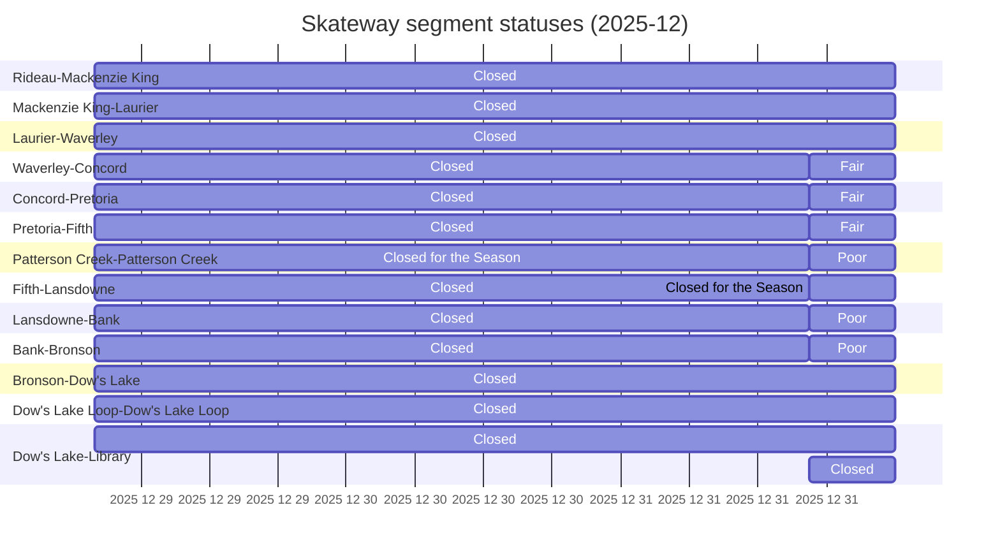

```mermaid
---
displayMode: compact
---
gantt
  title Skateway segment statuses (2025-12)
  dateFormat  YYYY-MM-DD HH:mm:ss
  axisFormat  %Y %m %d
  section Rideau-Mackenzie King
  Closed: c, 2025-12-29 01:57:41, 2025-12-31 23:59:59
  section Mackenzie King-Laurier
  Closed: c, 2025-12-29 01:57:41, 2025-12-31 23:59:59
  section Laurier-Waverley
  Closed: c, 2025-12-29 01:57:41, 2025-12-31 23:59:59
  section Waverley-Concord
  Closed: c, 2025-12-29 01:57:41, 2025-12-31 16:28:10
  Fair: f, 2025-12-31 16:28:10, 2025-12-31 23:59:59
  section Concord-Pretoria
  Closed: c, 2025-12-29 01:57:41, 2025-12-31 16:28:10
  Fair: f, 2025-12-31 16:28:10, 2025-12-31 23:59:59
  section Pretoria-Fifth
  Closed: c, 2025-12-29 01:57:41, 2025-12-31 16:28:10
  Fair: f, 2025-12-31 16:28:10, 2025-12-31 23:59:59
  section Patterson Creek-Patterson Creek
  Closed for the Season: cs, 2025-12-29 01:57:41, 2025-12-31 16:28:10
  Poor: p, 2025-12-31 16:28:10, 2025-12-31 23:59:59
  section Fifth-Lansdowne
  Closed: c, 2025-12-29 01:57:41, 2025-12-31 16:28:10
  Closed for the Season: cs, 2025-12-31 16:28:10, 2025-12-31 23:59:59
  section Lansdowne-Bank
  Closed: c, 2025-12-29 01:57:41, 2025-12-31 16:28:10
  Poor: p, 2025-12-31 16:28:10, 2025-12-31 23:59:59
  section Bank-Bronson
  Closed: c, 2025-12-29 01:57:41, 2025-12-31 16:28:10
  Poor: p, 2025-12-31 16:28:10, 2025-12-31 23:59:59
  section Bronson-Dow's Lake
  Closed: c, 2025-12-29 01:57:41, 2025-12-31 23:59:59
  section Dow's Lake Loop-Dow's Lake Loop
  Closed: c, 2025-12-29 01:57:41, 2025-12-31 23:59:59
  section Dow's Lake-Library
  Closed: c, 2025-12-29 01:57:41, 2025-12-31 23:59:59
  section Dow's Lake-Library
  Closed: c, 2025-12-31 16:28:10, 2025-12-31 23:59:59
```
