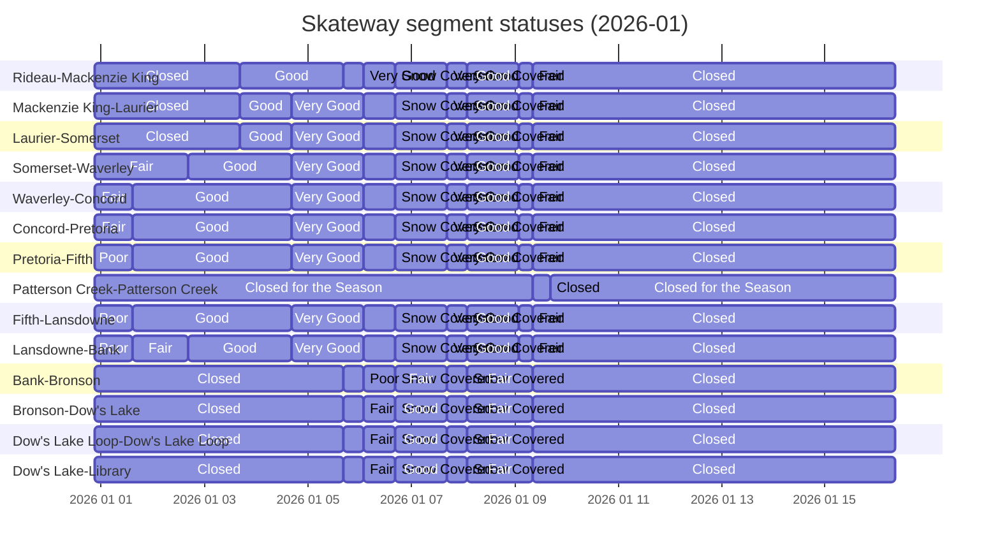

```mermaid
---
topAxis: true
displayMode: compact
config:
  themeCSS: " #vg { fill: Green } #g {fill: GreenYellow} #f {fill: orange} #p {fill: red}      

#c {fill: Black} #cs {fill: Black} #sc {fill: White} #wo {fill: saddlebrown} 

             text[id^=c] { fill: white; } text[id^=cs] { fill: red; } text[id^=sc] { fill: red; }
            .taskTextOutsideRight[id^=sc] { fill:black; text-anchor: end; }
        "

---

gantt
  title Skateway segment statuses (2026-01)
  dateFormat  YYYY-MM-DD HH:mm:ss
  axisFormat  %Y %m %d
  section Rideau-Mackenzie King
  Closed: c, 2025-12-31 21:07:33, 2026-01-03 16:27:35
  Good: g, 2026-01-03 16:27:35, 2026-01-05 16:29:55
  Very Good: vg, 2026-01-05 16:29:55, 2026-01-06 01:51:43
  Snow Covered: sc, 2026-01-06 01:51:43, 2026-01-06 16:31:50
  Very Good: vg, 2026-01-06 16:31:50, 2026-01-07 16:33:13
  Snow Covered: sc, 2026-01-07 16:33:13, 2026-01-08 01:51:39
  Good: g, 2026-01-08 01:51:39, 2026-01-09 01:52:12
  Fair: f, 2026-01-09 01:52:12, 2026-01-09 08:33:47
  Closed: c, 2026-01-09 08:33:47, 2026-01-16 08:32:58
  section Mackenzie King-Laurier
  Closed: c, 2025-12-31 21:07:33, 2026-01-03 16:27:35
  Good: g, 2026-01-03 16:27:35, 2026-01-04 16:26:52
  Very Good: vg, 2026-01-04 16:26:52, 2026-01-06 01:51:43
  Snow Covered: sc, 2026-01-06 01:51:43, 2026-01-06 16:31:50
  Very Good: vg, 2026-01-06 16:31:50, 2026-01-07 16:33:13
  Snow Covered: sc, 2026-01-07 16:33:13, 2026-01-08 01:51:39
  Good: g, 2026-01-08 01:51:39, 2026-01-09 01:52:12
  Fair: f, 2026-01-09 01:52:12, 2026-01-09 08:33:47
  Closed: c, 2026-01-09 08:33:47, 2026-01-16 08:32:58
  section Laurier-Somerset
  Closed: c, 2025-12-31 21:07:33, 2026-01-03 16:27:35
  Good: g, 2026-01-03 16:27:35, 2026-01-04 16:26:52
  Very Good: vg, 2026-01-04 16:26:52, 2026-01-06 01:51:43
  Snow Covered: sc, 2026-01-06 01:51:43, 2026-01-06 16:31:50
  Very Good: vg, 2026-01-06 16:31:50, 2026-01-07 16:33:13
  Snow Covered: sc, 2026-01-07 16:33:13, 2026-01-08 01:51:39
  Good: g, 2026-01-08 01:51:39, 2026-01-09 01:52:12
  Fair: f, 2026-01-09 01:52:12, 2026-01-09 08:33:47
  Closed: c, 2026-01-09 08:33:47, 2026-01-16 08:32:58
  section Somerset-Waverley
  Fair: f, 2025-12-31 21:07:33, 2026-01-02 16:28:08
  Good: g, 2026-01-02 16:28:08, 2026-01-04 16:26:52
  Very Good: vg, 2026-01-04 16:26:52, 2026-01-06 01:51:43
  Snow Covered: sc, 2026-01-06 01:51:43, 2026-01-06 16:31:50
  Very Good: vg, 2026-01-06 16:31:50, 2026-01-07 16:33:13
  Snow Covered: sc, 2026-01-07 16:33:13, 2026-01-08 01:51:39
  Good: g, 2026-01-08 01:51:39, 2026-01-09 01:52:12
  Fair: f, 2026-01-09 01:52:12, 2026-01-09 08:33:47
  Closed: c, 2026-01-09 08:33:47, 2026-01-16 08:32:58
  section Waverley-Concord
  Fair: f, 2025-12-31 21:07:33, 2026-01-01 14:52:27
  Good: g, 2026-01-01 14:52:27, 2026-01-04 16:26:52
  Very Good: vg, 2026-01-04 16:26:52, 2026-01-06 01:51:43
  Snow Covered: sc, 2026-01-06 01:51:43, 2026-01-06 16:31:50
  Very Good: vg, 2026-01-06 16:31:50, 2026-01-07 16:33:13
  Snow Covered: sc, 2026-01-07 16:33:13, 2026-01-08 01:51:39
  Good: g, 2026-01-08 01:51:39, 2026-01-09 01:52:12
  Fair: f, 2026-01-09 01:52:12, 2026-01-09 08:33:47
  Closed: c, 2026-01-09 08:33:47, 2026-01-16 08:32:58
  section Concord-Pretoria
  Fair: f, 2025-12-31 21:07:33, 2026-01-01 14:52:27
  Good: g, 2026-01-01 14:52:27, 2026-01-04 16:26:52
  Very Good: vg, 2026-01-04 16:26:52, 2026-01-06 01:51:43
  Snow Covered: sc, 2026-01-06 01:51:43, 2026-01-06 16:31:50
  Very Good: vg, 2026-01-06 16:31:50, 2026-01-07 16:33:13
  Snow Covered: sc, 2026-01-07 16:33:13, 2026-01-08 01:51:39
  Good: g, 2026-01-08 01:51:39, 2026-01-09 01:52:12
  Fair: f, 2026-01-09 01:52:12, 2026-01-09 08:33:47
  Closed: c, 2026-01-09 08:33:47, 2026-01-16 08:32:58
  section Pretoria-Fifth
  Poor: p, 2025-12-31 21:07:33, 2026-01-01 14:52:27
  Good: g, 2026-01-01 14:52:27, 2026-01-04 16:26:52
  Very Good: vg, 2026-01-04 16:26:52, 2026-01-06 01:51:43
  Snow Covered: sc, 2026-01-06 01:51:43, 2026-01-06 16:31:50
  Very Good: vg, 2026-01-06 16:31:50, 2026-01-07 16:33:13
  Snow Covered: sc, 2026-01-07 16:33:13, 2026-01-08 01:51:39
  Good: g, 2026-01-08 01:51:39, 2026-01-09 01:52:12
  Fair: f, 2026-01-09 01:52:12, 2026-01-09 08:33:47
  Closed: c, 2026-01-09 08:33:47, 2026-01-16 08:32:58
  section Patterson Creek-Patterson Creek
  Closed for the Season: cs, 2025-12-31 21:07:33, 2026-01-09 08:33:47
  Closed: c, 2026-01-09 08:33:47, 2026-01-09 16:30:59
  Closed for the Season: cs, 2026-01-09 16:30:59, 2026-01-16 08:32:58
  section Fifth-Lansdowne
  Poor: p, 2025-12-31 21:07:33, 2026-01-01 14:52:27
  Good: g, 2026-01-01 14:52:27, 2026-01-04 16:26:52
  Very Good: vg, 2026-01-04 16:26:52, 2026-01-06 01:51:43
  Snow Covered: sc, 2026-01-06 01:51:43, 2026-01-06 16:31:50
  Very Good: vg, 2026-01-06 16:31:50, 2026-01-07 16:33:13
  Snow Covered: sc, 2026-01-07 16:33:13, 2026-01-08 01:51:39
  Good: g, 2026-01-08 01:51:39, 2026-01-09 01:52:12
  Fair: f, 2026-01-09 01:52:12, 2026-01-09 08:33:47
  Closed: c, 2026-01-09 08:33:47, 2026-01-16 08:32:58
  section Lansdowne-Bank
  Poor: p, 2025-12-31 21:07:33, 2026-01-01 14:52:27
  Fair: f, 2026-01-01 14:52:27, 2026-01-02 16:28:08
  Good: g, 2026-01-02 16:28:08, 2026-01-04 16:26:52
  Very Good: vg, 2026-01-04 16:26:52, 2026-01-06 01:51:43
  Snow Covered: sc, 2026-01-06 01:51:43, 2026-01-06 16:31:50
  Very Good: vg, 2026-01-06 16:31:50, 2026-01-07 16:33:13
  Snow Covered: sc, 2026-01-07 16:33:13, 2026-01-08 01:51:39
  Good: g, 2026-01-08 01:51:39, 2026-01-09 01:52:12
  Fair: f, 2026-01-09 01:52:12, 2026-01-09 08:33:47
  Closed: c, 2026-01-09 08:33:47, 2026-01-16 08:32:58
  section Bank-Bronson
  Closed: c, 2025-12-31 21:07:33, 2026-01-05 16:29:55
  Poor: p, 2026-01-05 16:29:55, 2026-01-06 01:51:43
  Snow Covered: sc, 2026-01-06 01:51:43, 2026-01-06 16:31:50
  Fair: f, 2026-01-06 16:31:50, 2026-01-07 16:33:13
  Snow Covered: sc, 2026-01-07 16:33:13, 2026-01-08 01:51:39
  Fair: f, 2026-01-08 01:51:39, 2026-01-09 08:33:47
  Closed: c, 2026-01-09 08:33:47, 2026-01-16 08:32:58
  section Bronson-Dow's Lake
  Closed: c, 2025-12-31 21:07:33, 2026-01-05 16:29:55
  Fair: f, 2026-01-05 16:29:55, 2026-01-06 01:51:43
  Snow Covered: sc, 2026-01-06 01:51:43, 2026-01-06 16:31:50
  Good: g, 2026-01-06 16:31:50, 2026-01-07 16:33:13
  Snow Covered: sc, 2026-01-07 16:33:13, 2026-01-08 01:51:39
  Fair: f, 2026-01-08 01:51:39, 2026-01-09 08:33:47
  Closed: c, 2026-01-09 08:33:47, 2026-01-16 08:32:58
  section Dow's Lake Loop-Dow's Lake Loop
  Closed: c, 2025-12-31 21:07:33, 2026-01-05 16:29:55
  Fair: f, 2026-01-05 16:29:55, 2026-01-06 01:51:43
  Snow Covered: sc, 2026-01-06 01:51:43, 2026-01-06 16:31:50
  Good: g, 2026-01-06 16:31:50, 2026-01-07 16:33:13
  Snow Covered: sc, 2026-01-07 16:33:13, 2026-01-08 01:51:39
  Fair: f, 2026-01-08 01:51:39, 2026-01-09 08:33:47
  Closed: c, 2026-01-09 08:33:47, 2026-01-16 08:32:58
  section Dow's Lake-Library
  Closed: c, 2025-12-31 21:07:33, 2026-01-05 16:29:55
  Fair: f, 2026-01-05 16:29:55, 2026-01-06 01:51:43
  Snow Covered: sc, 2026-01-06 01:51:43, 2026-01-06 16:31:50
  Good: g, 2026-01-06 16:31:50, 2026-01-07 16:33:13
  Snow Covered: sc, 2026-01-07 16:33:13, 2026-01-08 01:51:39
  Fair: f, 2026-01-08 01:51:39, 2026-01-09 08:33:47
  Closed: c, 2026-01-09 08:33:47, 2026-01-16 08:32:58
```
