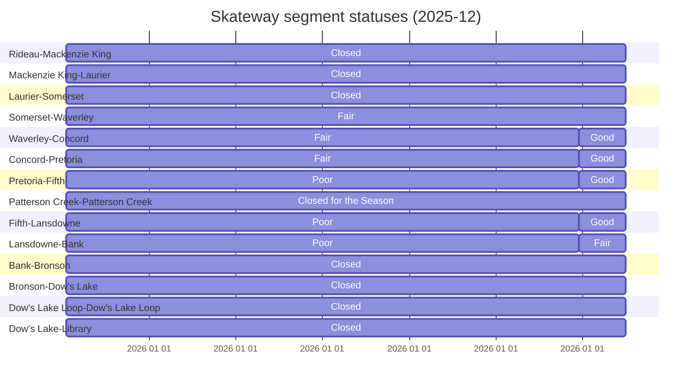

```mermaid
---
topAxis: true
displayMode: compact
config:
  themeCSS: " #vg { fill: Green } #g {fill: yellow} #f {fill: orange} #p {fill: red}      \n
#c {fill: Black} #cs {fill: Black} #sc {fill: White} #wo {fill: saddlebrown} \n
            text[id^=cs] { fill: red; } text[id^=sc] { fill: red; }
        "
---

gantt
  title Skateway segment statuses (2025-12)
  dateFormat  YYYY-MM-DD HH:mm:ss
  axisFormat  %Y %m %d
  section Rideau-Mackenzie King
  Closed: c, 2025-12-31 21:07:33, 2026-01-01 16:29:36
  section Mackenzie King-Laurier
  Closed: c, 2025-12-31 21:07:33, 2026-01-01 16:29:36
  section Laurier-Somerset
  Closed: c, 2025-12-31 21:07:33, 2026-01-01 16:29:36
  section Somerset-Waverley
  Fair: f, 2025-12-31 21:07:33, 2026-01-01 16:29:36
  section Waverley-Concord
  Fair: f, 2025-12-31 21:07:33, 2026-01-01 14:52:27
  Good: g, 2026-01-01 14:52:27, 2026-01-01 16:29:36
  section Concord-Pretoria
  Fair: f, 2025-12-31 21:07:33, 2026-01-01 14:52:27
  Good: g, 2026-01-01 14:52:27, 2026-01-01 16:29:36
  section Pretoria-Fifth
  Poor: p, 2025-12-31 21:07:33, 2026-01-01 14:52:27
  Good: g, 2026-01-01 14:52:27, 2026-01-01 16:29:36
  section Patterson Creek-Patterson Creek
  Closed for the Season: cs, 2025-12-31 21:07:33, 2026-01-01 16:29:36
  section Fifth-Lansdowne
  Poor: p, 2025-12-31 21:07:33, 2026-01-01 14:52:27
  Good: g, 2026-01-01 14:52:27, 2026-01-01 16:29:36
  section Lansdowne-Bank
  Poor: p, 2025-12-31 21:07:33, 2026-01-01 14:52:27
  Fair: f, 2026-01-01 14:52:27, 2026-01-01 16:29:36
  section Bank-Bronson
  Closed: c, 2025-12-31 21:07:33, 2026-01-01 16:29:36
  section Bronson-Dow's Lake
  Closed: c, 2025-12-31 21:07:33, 2026-01-01 16:29:36
  section Dow's Lake Loop-Dow's Lake Loop
  Closed: c, 2025-12-31 21:07:33, 2026-01-01 16:29:36
  section Dow's Lake-Library
  Closed: c, 2025-12-31 21:07:33, 2026-01-01 16:29:36
```
