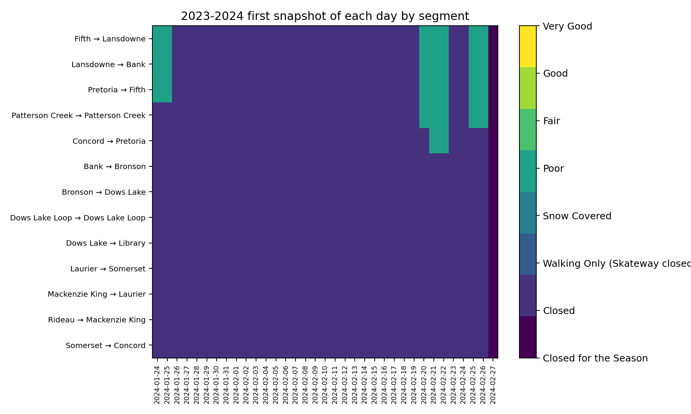
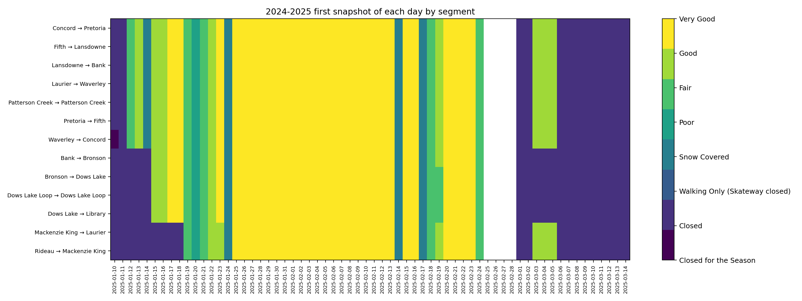
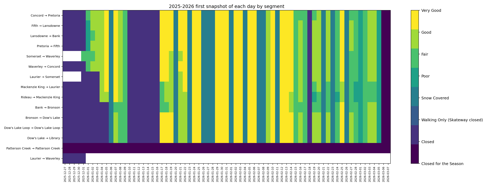

# Season-End Writeup (Revised)

This rewrite uses `current_conditions.csv` and focuses on season open/close timing, segment-by-segment opening order, first-snapshot daily heatmaps, and overnight maintenance effectiveness.

## 1) Season opening and closing timing

Definition used:
- **Opened for season** = first snapshot with any skateable segment (`Poor/Fair/Good/Very Good/Snow Covered`).
- **Closed for season** = first zero-open snapshot after the season's final open snapshot.

| season    | first_snapshot             | last_snapshot              | first_open_for_season      | last_closed_for_season     |   days_open_window |   avg_open_pct |   peak_open_pct |
|:----------|:---------------------------|:---------------------------|:---------------------------|:---------------------------|-------------------:|---------------:|----------------:|
| 2023-2024 | 2024-01-24 03:37:31.941580 | 2024-02-27 00:32:10.939937 | 2024-01-24 03:37:31.941580 | 2024-02-26 08:09:42.357276 |                 33 |        5.15873 |         37.1795 |
| 2024-2025 | 2025-01-10 07:41:44.802344 | 2025-03-14 16:09:56.401991 | 2025-01-11 16:08:22.642281 | 2025-03-05 08:11:48.098464 |                 52 |       75.1536  |        100      |
| 2025-2026 | 2025-12-27 19:17:23.272797 | 2026-03-07 07:09:16.033637 | 2025-12-31 16:28:10.164647 | 2026-03-05 08:45:33.084315 |                 63 |       70.0213  |        100      |

## 2) 2023-2024: Segment first-open sequence

|    | segment                           | 1st date open              |   days after the 1st segment |
|---:|:----------------------------------|:---------------------------|-----------------------------:|
|  1 | Fifth → Lansdowne                 | 2024-01-24 03:37:31.941580 |                         0    |
|  2 | Lansdowne → Bank                  | 2024-01-24 03:37:31.941580 |                         0    |
|  3 | Pretoria → Fifth                  | 2024-01-24 03:37:31.941580 |                         0    |
|  4 | Patterson Creek → Patterson Creek | 2024-02-20 00:31:44.371597 |                        26.87 |
|  5 | Concord → Pretoria                | 2024-02-21 00:32:15.408289 |                        27.87 |

## 2) 2024-2025: Segment first-open sequence

|    | segment                           | 1st date open              |   days after the 1st segment |
|---:|:----------------------------------|:---------------------------|-----------------------------:|
|  1 | Concord → Pretoria                | 2025-01-11 16:08:22.642281 |                            0 |
|  2 | Fifth → Lansdowne                 | 2025-01-11 16:08:22.642281 |                            0 |
|  3 | Lansdowne → Bank                  | 2025-01-11 16:08:22.642281 |                            0 |
|  4 | Laurier → Waverley                | 2025-01-11 16:08:22.642281 |                            0 |
|  5 | Patterson Creek → Patterson Creek | 2025-01-11 16:08:22.642281 |                            0 |
|  6 | Pretoria → Fifth                  | 2025-01-11 16:08:22.642281 |                            0 |
|  7 | Waverley → Concord                | 2025-01-11 16:08:22.642281 |                            0 |
|  8 | Bank → Bronson                    | 2025-01-14 16:10:53.012050 |                            3 |
|  9 | Bronson → Dows Lake               | 2025-01-14 16:10:53.012050 |                            3 |
| 10 | Dows Lake Loop → Dows Lake Loop   | 2025-01-14 16:10:53.012050 |                            3 |
| 11 | Dows Lake → Library               | 2025-01-14 16:10:53.012050 |                            3 |
| 12 | Mackenzie King → Laurier          | 2025-01-18 16:07:53.316476 |                            7 |
| 13 | Rideau → Mackenzie King           | 2025-01-18 16:07:53.316476 |                            7 |

## 2) 2025-2026: Segment first-open sequence

|    | segment                           | 1st date open              |   days after the 1st segment |
|---:|:----------------------------------|:---------------------------|-----------------------------:|
|  1 | Concord → Pretoria                | 2025-12-31 16:28:10.164647 |                            0 |
|  2 | Fifth → Lansdowne                 | 2025-12-31 16:28:10.164647 |                            0 |
|  3 | Lansdowne → Bank                  | 2025-12-31 16:28:10.164647 |                            0 |
|  4 | Pretoria → Fifth                  | 2025-12-31 16:28:10.164647 |                            0 |
|  5 | Somerset → Waverley               | 2025-12-31 16:28:10.164647 |                            0 |
|  6 | Waverley → Concord                | 2025-12-31 16:28:10.164647 |                            0 |
|  7 | Laurier → Somerset                | 2026-01-03 16:27:35.989282 |                            3 |
|  8 | Mackenzie King → Laurier          | 2026-01-03 16:27:35.989282 |                            3 |
|  9 | Rideau → Mackenzie King           | 2026-01-03 16:27:35.989282 |                            3 |
| 10 | Bank → Bronson                    | 2026-01-05 16:29:55.341427 |                            5 |
| 11 | Bronson → Dow's Lake              | 2026-01-05 16:29:55.341427 |                            5 |
| 12 | Dow's Lake Loop → Dow's Lake Loop | 2026-01-05 16:29:55.341427 |                            5 |
| 13 | Dow's Lake → Library              | 2026-01-05 16:29:55.341427 |                            5 |
| 14 | Patterson Creek → Patterson Creek | 2026-02-08 16:34:06.361591 |                           39 |

## 3) Daily first-snapshot heatmaps (by segment)

### 2023-2024

### 2024-2025

### 2025-2026

## 4) Novel analysis highlights

- **2023-2024 rollout spread**: 27.87 days from first-open segment to final first-open segment (Concord → Pretoria).
- **2023-2024 network volatility**: average open 5.2% with snapshot std dev 11.6 points.
- **2024-2025 rollout spread**: 7.00 days from first-open segment to final first-open segment (Mackenzie King → Laurier).
- **2024-2025 network volatility**: average open 75.2% with snapshot std dev 40.3 points.
- **2025-2026 rollout spread**: 39.00 days from first-open segment to final first-open segment (Patterson Creek → Patterson Creek).
- **2025-2026 network volatility**: average open 70.0% with snapshot std dev 40.1 points.

## 5) Maintenance quality and impact analysis

Method: for each segment and day, compare the **last status of day D** to the **first status of day D+1**, attributing overnight change to maintenance type reported at first snapshot on day D+1.

### 2023-2024 overnight transitions by maintenance type

| season    | overnight_maint         |   transitions |   avg_delta |   median_delta |   improve_rate |   decline_rate |
|:----------|:------------------------|--------------:|------------:|---------------:|---------------:|---------------:|
| 2023-2024 | No maintenance reported |           408 |        0    |              0 |            0   |              0 |
| 2023-2024 | Swept and flooded       |            13 |        0.77 |              0 |           38.5 |              0 |
| 2023-2024 | Swept                   |            12 |        0    |              0 |            0   |              0 |
| 2023-2024 | Flooded                 |             8 |        0    |              0 |            0   |              0 |
| 2023-2024 | No maintenance          |             1 |        0    |              0 |            0   |              0 |

### 2024-2025 overnight transitions by maintenance type

| season    | overnight_maint         |   transitions |   avg_delta |   median_delta |   improve_rate |   decline_rate |
|:----------|:------------------------|--------------:|------------:|---------------:|---------------:|---------------:|
| 2024-2025 | Swept and flooded       |           322 |        0.03 |              0 |            2.8 |            0   |
| 2024-2025 | No maintenance reported |           143 |        0    |              0 |            0   |            0   |
| 2024-2025 | Swept                   |           116 |       -0.22 |              0 |            0   |           11.2 |
| 2024-2025 | Snow removal            |           104 |        0.12 |              0 |           12.5 |            0   |
| 2024-2025 | Sweeping                |            29 |        0    |              0 |            0   |            0   |
| 2024-2025 | No maintenance          |            25 |        0    |              0 |            0   |            0   |
| 2024-2025 | Plowed                  |            15 |        0    |              0 |            0   |            0   |

### 2025-2026 overnight transitions by maintenance type

| season    | overnight_maint         |   transitions |   avg_delta |   median_delta |   improve_rate |   decline_rate |
|:----------|:------------------------|--------------:|------------:|---------------:|---------------:|---------------:|
| 2025-2026 | Swept and flooded       |           525 |       -0.26 |              0 |           10.3 |           23.6 |
| 2025-2026 | No maintenance          |           134 |        0    |              0 |            0   |            0   |
| 2025-2026 | No maintenance reported |           131 |        0    |              0 |            0   |            0   |
| 2025-2026 | Swept                   |            84 |        0.32 |              0 |           15.5 |           21.4 |
| 2025-2026 | Snow removal            |            78 |       -0.72 |              0 |           16.7 |           33.3 |
| 2025-2026 | Sweeping                |            13 |        0    |              0 |            0   |            0   |
| 2025-2026 | Plowed                  |            11 |        2    |              2 |          100   |            0   |

### Nights where maintenance would likely have been beneficial

Criteria: previous evening ended as `Snow Covered`, `Poor`, `Fair`, or `Closed`; overnight maintenance was not one of swept/flooded/plowed/snow-removal actions.

| season    |   total_beneficial_nights |   nights_without_active_maintenance |   share_without_active_maintenance_% |
|:----------|--------------------------:|------------------------------------:|-------------------------------------:|
| 2023-2024 |                       429 |                                 396 |                                 92.3 |
| 2024-2025 |                       298 |                                 168 |                                 56.4 |
| 2025-2026 |                       432 |                                 169 |                                 39.1 |

- **2023-2024 best avg effect**: `Swept and flooded` (+0.77 quality points).
- **2023-2024 worst avg effect**: `Swept` (+0.00 quality points).
- **2024-2025 best avg effect**: `Snow removal` (+0.12 quality points).
- **2024-2025 worst avg effect**: `Swept` (-0.22 quality points).
- **2025-2026 best avg effect**: `Plowed` (+2.00 quality points).
- **2025-2026 worst avg effect**: `Snow removal` (-0.72 quality points).